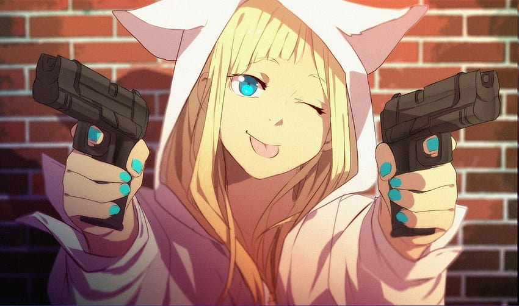

# First-Person Shooter Game

Welcome to our exciting first-person shooter game! Engage in fast-paced action, explore immersive environments, and battle against formidable foes. Prepare for an adrenaline-pumping gaming experience like no other!

## Table of Contents

- [First-Person Shooter Game](#first-person-shooter-game)
  - [Table of Contents](#table-of-contents)
  - [APIs Used](#apis-used)
  - [JavaScript Library](#javascript-library)
  - [How to Play](#how-to-play)
  - [Features](#features)
  - [Contributing](#contributing)
  - [License](#license)

## APIs Used

This game leverages the following APIs and technologies:

- [THREE.js](https://threejs.org/): A popular JavaScript 3D library for creating stunning 3D graphics and animations in the browser.

- [Web Audio API](https://developer.mozilla.org/en-US/docs/Web/API/Web_Audio_API): Used for sound effects and audio playback within the game.

- [Pointer Lock API](https://developer.mozilla.org/en-US/docs/Web/API/Pointer_Lock_API): Provides mouse pointer control for an immersive gaming experience.

## JavaScript Library

This game is built using the THREE.js JavaScript library, which allows for the creation of 3D environments, rendering, and animations.

## How to Play

1. **Pointer Lock:** To begin, enable the pointer lock by clicking the game canvas. This locks your mouse pointer for full control within the game.

2. **Movement:** Use the WASD keys or arrow keys to move your character within the game world.

3. **Jump:** Press the spacebar to jump and navigate obstacles.

4. **Run:** Hold the Shift key to sprint for faster movement.

5. **Shoot:** Left-click to fire your weapon and defeat enemies.

6. **Look Around:** Move your mouse to look around and aim.

7. **Reload:** R key (if applicable) to reload your weapon.

8. **Interact:** Explore the game world to discover items, enemies, and objectives.

9. **Win:** Complete objectives and defeat enemies to progress through the game and achieve victory.

## Features

- **Immersive 3D Environment:** Experience a visually stunning 3D world with realistic graphics and animations.

- **Intense Combat:** Engage in thrilling battles against AI-controlled enemies.

- **Sound Effects:** Enjoy immersive audio effects and background music that enhance the gaming experience.

- **Exploration:** Explore diverse game environments, discover hidden items, and complete challenging objectives.

- **Pointer Lock:** Use the Pointer Lock API for precise mouse control, enhancing gameplay immersion.

- **Customization:** Customize your character and weapons for a personalized gaming experience.

- **Sprint and Jump:** Utilize sprint and jump mechanics to navigate obstacles and defeat enemies.

- **Responsive Controls:** Enjoy smooth and responsive controls for an enjoyable gaming experience.

## Contributing

We welcome contributions from the community to improve and expand the game. Feel free to submit bug reports, feature requests, or pull requests to help make this game even better.

## License

This game is open-source and licensed under the [MIT License](LICENSE). You are free to use, modify, and distribute it according to the terms of the license.
